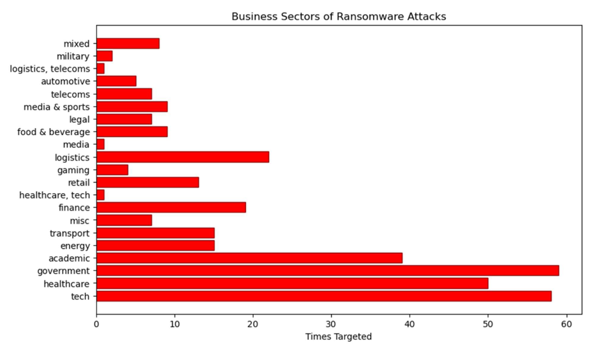

# Counter-Ransomware Analysis

## Overview

This project was a practice in data exploration while analyzing reported ransomware attacks in order to find trends in targeting behavior.

## Analysis

Plots and other visualization tools were utilized in the analysis of ransomware data. Insights were generated and can be found within the included PDF.

<a href="https://github.com/kinikepike1/ProjectShowcase/tree/main/CounterRansomware/Counter-Ransomware.pdf" target="_blank" rel="noopener noreferrer">Full Writeup</a>
