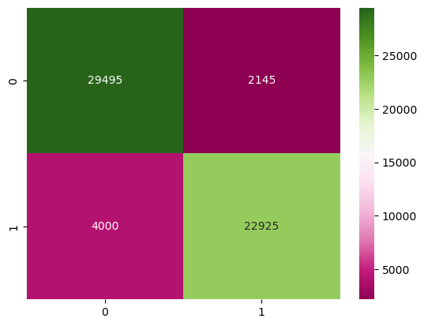

# Kickstarter Success Analysis

## Overview
The goal with this project is to find which category and subcategory of project that has the highest likelihood of successfully funding during its campaign as well as creating a model with a high accuracy of predicting the success of a campaign.

## Data Explanation
The data used in this project was obtained from <a href="https://www.kaggle.com/datasets/ulrikthygepedersen/kickstarter-projects" target="_blank" rel="noopener noreferrer">Kaggle</a>. This dataset contains category, subcategory, start, end, funding goal, and final amount pledged data. The data ranges from the years 2009 to 2018 and possesses >350,000 datapoints.

## Analysis
Logistic regression used for this project. The model maintained a prediction accuracy of nearly 90%. The most influential features were also identified by scoring their coefficients. The top five positive and negative features by their coefficients were recorded. This led to similar models being built for categories, subcategories, and countries. Confusion matrix of end model below.

<a href="https://github.com/kinikepike1/ProjectShowcase/tree/main/KickstarterSuccessAnalysis" target="_blank" rel="noopener noreferrer">Full repo</a>
