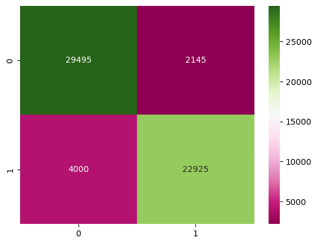

## Kickstarter Success Analysis

### Summary
My goal with this project is to find which category and subcategory of project that has the highest likelihood of successfully funding during its campaign as well as creating a model with a high accuracy of predicting the success of a campaign.

### Data Explanation
The data used in this project was obtained from Kaggle (https://www.kaggle.com/datasets/ulrikthygepedersen/kickstarter-projects). This dataset contains category, subcategory, start, end, funding goal, and final amount pledged data. The data ranges from the years 2009 to 2018 and possesses >350,000 datapoints.

### Analysis
Logistic regression used for this project. The model maintained a prediction accuracy of nearly 90%. The most influential features were also identified by scoring their coefficients. The top five positive and negative features by their coefficients were recorded. This led to similar models being built for categories, subcategories, and countries.

### Conclusion
This visualization shows the actual outcome of campaigns on the x-axis as 0 being a failed campaign and 1 being a successful campaign with the predicted outcome of campaigns on the y-axis is attempting to predict the outcome based on all of the categorical data gathered. This is accurate, but tends to predict false positive (bottom-left quadrant) about twice as often as it predicts false negatives (top-right quadrant). The outcome of this model was better than expected and fulfilled the original goal of the project. In a future iteration, end of day totals could be added for live project monitoring to more accurately predict the projected end state of the project in conjunction with the insight generated with this model.
