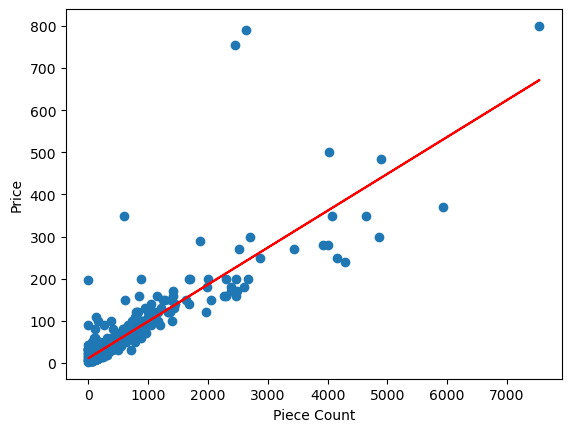

# Lego Price Analysis

## Overview

This project was aimed at identifying key features that inform Lego set price points with the hypothesis that certain intelectual properties would inflate the sets' prices.

## Analysis

A data exploration, decision tree classifier, as well as a linear model were used in attempts to derive insights from the dataset.

<a href="https://github.com/kinikepike1/ProjectShowcase/tree/main/LegoPriceAnalysis" target="_blank" rel="noopener noreferrer">Full repo</a>
