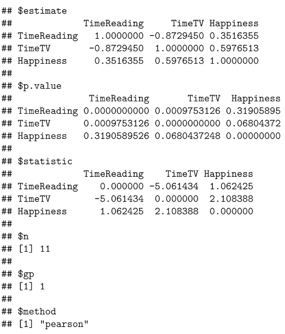

# Student Happiness Survey Analysis

## Overview

This is a small exercise written in R markdown to determine is watching TV or reading books has any impact on student happiness. Written to satisfy requirements for Bellevue University's Statistics for Data Science course.

<a href="https://github.com/kinikepike1/ProjectShowcase/tree/main/StudentSurveyAnalysis/student-survey_FoxKinnick.pdf" target="_blank" rel="noopener noreferrer">Full Writeup</a>
