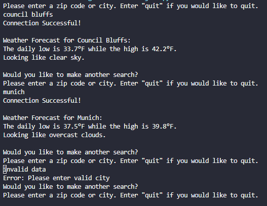

# Weather API with Python

## Overview

This small script was created to satisfy a Bellevue University Python course. The script runs error checks for connection to the API, valid query, and valid credentials gracefully, allowing for multiple attempts without having to relaunch the script. Please note that the API key was removed and a new key will need to be generated from <a href="https://openweathermap.org/api" target="_blank" rel="noopener noreferrer">Open Weather</a> to function.

<a href="https://github.com/kinikepike1/ProjectShowcase/tree/main/WeatherApplication" target="_blank" rel="noopener noreferrer">Full repo</a>
