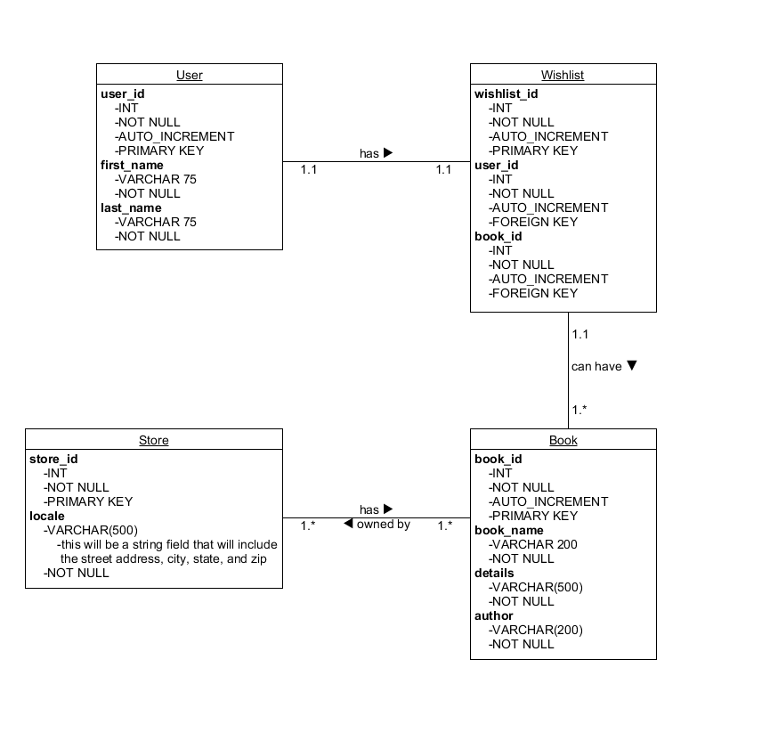

# WhatABook

## Overview

This project was done to meet requirements for Bellevue University's Data Security course. It shows the construction of a basic, locally stored SQL database in which book data is stored and can be retrieved.

## Application

Python was used for this project and some credetials have been removed for security purposes.

<a href="https://github.com/kinikepike1/ProjectShowcase/tree/main/WhatABookProject" target="_blank" rel="noopener noreferrer">Full repo</a>
